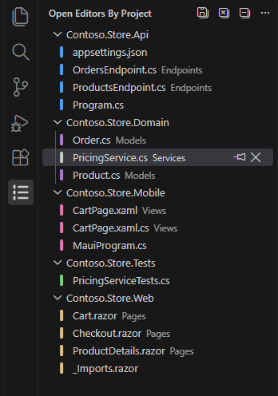
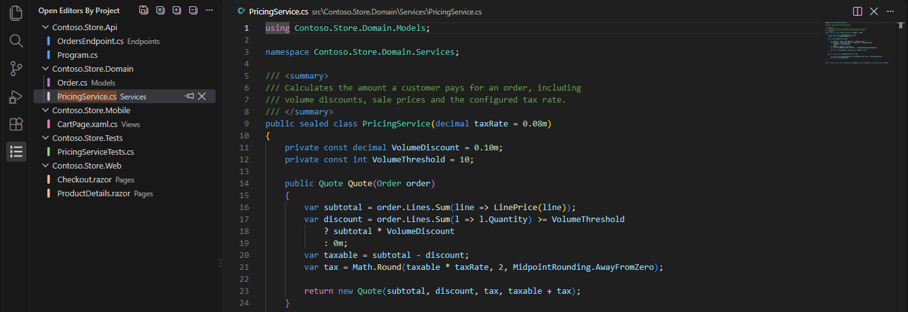
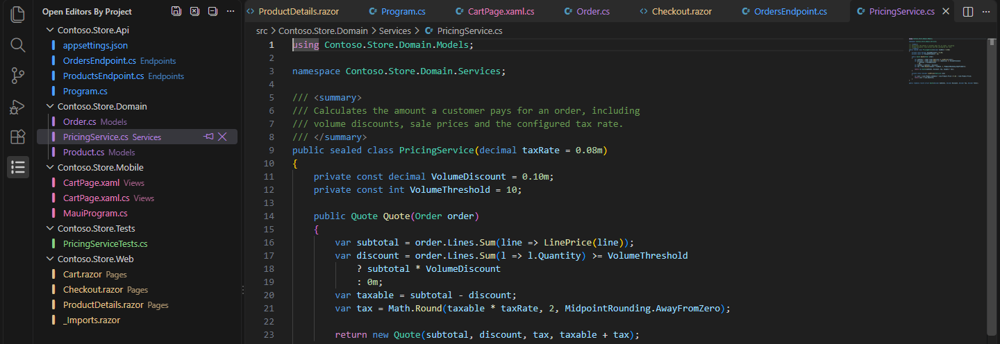

# Open Editor Groups

Groups your open editors by project and colors them per project, the way the **Tabs** window in Visual Studio 2026 does.



## Where is it?

The extension adds an **Open Editors by Project** icon to the Activity Bar (the column of icons on the left). Click it to see your open editors grouped by project. The built-in *Open Editors* section of the Explorer is not changed, because VS Code does not let extensions modify built-in views; the walkthrough below shows how to hide it.

After installation VS Code opens the extension's **Getting Started** walkthrough. You can reopen it any time with the command **Open Editor Groups: Getting Started** (also in the view's `...` menu). It walks through the steps in [Customize further](#customize-further) with one-click buttons.

## Features

- **Grouping by project.** Every open editor is listed under the nearest enclosing folder that contains a project file (`*.csproj`, `*.fsproj`, `*.vbproj`, `package.json`, `Cargo.toml`, ... configurable). Files that belong to no project are grouped by workspace folder, then *Untitled*, *External* and *Other* (Settings, Welcome, webviews, ...). Grouping by folder, by workspace folder, or a flat list are available too.
- **Solutions.** When the workspace contains two or more `.sln`/`.slnx` files, projects are grouped under the solution that references them (`openEditorGroups.solutionNodes`).
- **Project colors.** Each project gets a stable color from a 12-slot palette. The palette slots are theme colors, so they follow light/dark/high-contrast themes and can be customized. Pin a project to a color with **Set Project Color...**, or color by file-path rules instead of by project.
- **Visual Studio ordering.** Projects and files are sorted alphabetically (case-insensitive ordinal, so `_Imports.razor` sorts last like in Visual Studio). Other orders: editor order, most recently used, file type. Pinned editors come first, or get their own *Pinned* node.
- **Follows the active editor.** The active editor is selected and shown in bold; unsaved editors get a dot; the view's badge counts unsaved editors.
- **Editor actions.** Click to open, hover for *Pin*/*Close*. The context menu has *Open to the Side*, *Reveal in Explorer View*, *Copy Path*, *Close Others in Project*, *Close Saved in Project*, *Close All in Project* and more. The title bar has *Save All*, *Close All Editors*, *Expand All* and *Collapse All*.
- **Multi-select and drag.** <kbd>Ctrl</kbd>+click or <kbd>Shift</kbd>+click several files (or a whole project); *Close*, *Pin*, *Open to the Side* and *Copy Path* then act on all of them. Drag a file, or a project, from the view into the editor area to open it there or in a new split.
- **Split editors.** With several editor groups the view adds a top-level node per group (like the built-in Open Editors view). Turn this off with `openEditorGroups.groupByEditorGroup` to see one list, where only editors outside the first group that holds a file carry an "editor group N" note.
- **Colorize the real tabs (opt-in).** `openEditorGroups.colorizeTabs` tints the editor tab titles (and the file labels in other views) with the project color through file decorations.

## Customize further

### Hide the built-in Open Editors section

The Explorer's own *Open Editors* section keeps listing the same files. Run **Open Editor Groups: Hide Built-in Open Editors View**, which writes this to your user settings (**Show Built-in Open Editors View** restores it):

```jsonc
"explorer.openEditors.visible": 0
```

### Show only the active editor's tab

With every open file listed in the view, the tab bar can shrink to the active editor only, like the Visual Studio Tabs window, so files are not listed twice. Run **Open Editor Groups: Show Only the Active Editor Tab** (or **Hide Editor Tabs** for no tab bar at all; **Show All Editor Tabs** goes back):

```jsonc
"workbench.editor.showTabs": "single"   // or "none"
```



### Color the editor tabs

Toggle **Colorize Editor Tabs** in the view's `...` menu, or set `openEditorGroups.colorizeTabs`. Needs `workbench.editor.decorations.colors` (on by default). Source control and problem colors keep precedence on files that have them.



### Grouping, sorting, paths and icons

- `openEditorGroups.groupBy`: `project` (default), `folder`, `workspaceFolder` or `none`.
- `openEditorGroups.solutionNodes`: `auto` (default, only with two or more solutions), `always` or `never`.
- `openEditorGroups.sortOrder`: `alphabetical`, `editorOrder`, `mostRecentlyUsed` or `fileType`; `openEditorGroups.pinnedEditors`: `first`, `separateGroup` or `inline`.
- `openEditorGroups.pathStyle: "none"` hides the folder path next to each file, which is closest to the Visual Studio look.
- `openEditorGroups.fileIconStyle: "fileType"` shows file-type icons instead of color bars and moves the bar to the project header (`openEditorGroups.headerIcon` controls the header icon independently).
- `openEditorGroups.showPinButton` / `openEditorGroups.showCloseButton` hide the hover buttons; `openEditorGroups.focusEditorOnClick: false` keeps keyboard focus in the view.

### Color by file pattern

Instead of coloring by project, color by regular expressions on the workspace-relative path (first match wins, unmatched files use the unassigned color):

```jsonc
"openEditorGroups.colorBy": "rules",
"openEditorGroups.colorRules": [
  { "pattern": "\\.razor$", "color": 4 },
  { "pattern": "/Tests?/", "color": 9 },
  { "pattern": "^src/", "color": 1 }
]
```

### Move the view

Drag the view's Activity Bar icon into the Explorer (then drag its header above *Folders*) to have everything in one side bar, or into the Secondary Side Bar to keep it open next to the editor. `workbench.sideBar.location: "right"` mirrors Visual Studio's *Tab layout: Right*. **View: Reset View Locations** undoes any move.

### Keyboard shortcut

No shortcut is shipped. To add one, open **Preferences: Open Keyboard Shortcuts (JSON)**:

```jsonc
{ "key": "ctrl+alt+o", "command": "openEditorGroups.view.focus" },
{ "key": "delete", "command": "openEditorGroups.close", "when": "focusedView == openEditorGroups.view" }
```

The second binding closes whatever is selected in the view.

## Settings

| Setting | Default | Description |
| --- | --- | --- |
| `openEditorGroups.projectFilePatterns` | `.csproj`, `.fsproj`, `.vbproj`, `.vcxproj`, `.esproj`, `.sqlproj`, `.wapproj`, `.shproj`, `.pyproj`, `.njsproj`, `package.json`, `Cargo.toml`, `go.mod`, `pyproject.toml`, `pom.xml`, `build.gradle(.kts)` | File name patterns that mark a project root. Earlier patterns win inside one folder. |
| `openEditorGroups.groupBy` | `project` | `project`, `folder`, `workspaceFolder` or `none`. Colors always come from the file's project (or color rules). |
| `openEditorGroups.solutionNodes` | `auto` | Add a node per `.sln`/`.slnx`: `auto` (two or more solutions), `always`, `never`. Projects in no solution go under *Other projects*. |
| `openEditorGroups.groupByEditorGroup` | `true` | Add a node per editor group when the editor area is split. When off, editors outside the first group that holds a file are marked "editor group N". |
| `openEditorGroups.hideSingleGroup` | `false` | List the editors without a header when everything belongs to one project. |
| `openEditorGroups.showNonFileEditors` | `true` | List editors without a file (Settings, Welcome, ...) under *Other*. |
| `openEditorGroups.sortOrder` | `alphabetical` | `alphabetical`, `editorOrder`, `mostRecentlyUsed` or `fileType`. |
| `openEditorGroups.pinnedEditors` | `first` | Pinned editors `first` in each project, in a `separateGroup`, or `inline`. |
| `openEditorGroups.pathStyle` | `relativeToProject` | Path shown next to the file: `relativeToProject`, `relativeToWorkspace` or `none`. |
| `openEditorGroups.fileIconStyle` | `projectColorBar` | `projectColorBar` shows the colored bar on each file; `fileType` shows the file icon theme's icon. |
| `openEditorGroups.headerIcon` | `auto` | Icon on project headers: `auto` (bar only with `fileType` icons), `bar`, `dot` or `none`. |
| `openEditorGroups.showEditorCount` | `false` | Show the number of editors next to each header. |
| `openEditorGroups.dirtyIndicator` | `dot` | Mark unsaved editors with `dot` (●), `asterisk` (*) or `none`. |
| `openEditorGroups.emphasizeActiveEditor` | `true` | Show the active editor's name in bold. |
| `openEditorGroups.autoReveal` | `true` | Select the active editor in the view. |
| `openEditorGroups.focusEditorOnClick` | `true` | Move keyboard focus to the editor when a file is clicked. `false` keeps focus in the view. |
| `openEditorGroups.showPinButton` | `true` | Show the inline *Pin*/*Unpin* button on hover. The commands stay in the context menu. |
| `openEditorGroups.showCloseButton` | `true` | Show the inline *Close* button on files and *Close All* on projects on hover. |
| `openEditorGroups.colorBy` | `project` | `project`, `rules` (see `colorRules`) or `none`. |
| `openEditorGroups.colorRules` | `[]` | `{ "pattern": regex, "color": 1-12 }` rules matched against the workspace-relative path; first match wins. |
| `openEditorGroups.colorizeTabs` | `false` | Color editor tab titles with the project color. Needs `workbench.editor.decorations.colors`. |
| `openEditorGroups.projectColorOverrides` | `{}` | Project name to palette slot (1-12). Written by **Set Project Color...**. |

### Changing the palette

The slots are theme colors named `openEditorGroups.projectColor1` through `openEditorGroups.projectColor12` (blue, purple, teal, gold, orange, red, pink, cyan, green, indigo, brown, gray) plus `openEditorGroups.unassignedColor`. Override them like any other workbench color:

```jsonc
"workbench.colorCustomizations": {
  "openEditorGroups.projectColor1": "#ff8800"
}
```

## How project detection works

For each open file the extension walks up the folder tree, starting at the file's folder, and stops at the first folder that contains a file matching one of `projectFilePatterns`. The walk never leaves the workspace folder. Directory listings are cached and refreshed automatically when project files are created or deleted. `git:` URIs (for example *Open File (HEAD)*) are mapped to their on-disk path so they group with their project.

For manifests whose file name is generic (`package.json`, `Cargo.toml`, `go.mod`, `pyproject.toml`, `pom.xml`, `build.gradle`) the containing folder's name is used as the project name; for everything else the file name without its extension is used (`Contoso.Server.csproj` becomes `Contoso.Server`).

Solutions are found with a workspace search for `*.sln` and `*.slnx`. Classic `.sln` files are parsed line by line (solution folders are skipped); `.slnx` files are scanned for `<Project Path="..."/>` elements. A project referenced by several solutions is shown under the first one in name order; the others are listed in its tooltip.

## Development

```powershell
npm install
npm run compile      # type-check and bundle into dist/
npm run watch        # rebuild on change (also the default build task for F5)
npm run vsix:local   # build a .vsix for local installs (no repository URL needed)
npm run vsix         # build the .vsix for publishing (requires "repository" in package.json)
npm run build:icons  # regenerate resources/icons/open-editor-groups.woff (needs: pip install fonttools)
```

Press <kbd>F5</kbd> in VS Code to launch an Extension Development Host with the extension loaded.

### Publishing to the Marketplace

1. Set `publisher` in `package.json` to your Marketplace publisher ID.
2. Set `repository.url` in `package.json` to the public Git repository. `vsce` uses it to turn the relative image links in this README into absolute URLs; without it the screenshots would be broken on the Marketplace page.
3. Run `npm run vsix` and `npx vsce publish`.

## Known limitations

- Pin/unpin works by activating the editor first, because VS Code has no API to pin an editor that is not active.
- Editors that are not backed by a resource (webviews, terminals in the editor area) are activated by index, which relies on the built-in `workbench.action.openEditorAtIndex` command.
- Tab colorizing uses file decorations, which VS Code also uses for source control status and problems. Where both apply, the earlier registered decoration (usually Git) wins.
- Dragging a file from the view onto the Explorer copies it into the target folder, as with editor tabs (VS Code's behavior for resource drags).
- With `focusEditorOnClick: false`, a file in another editor group is shown but that group is not activated.
- The `.slnx` parser does not decode XML entities in project paths.
